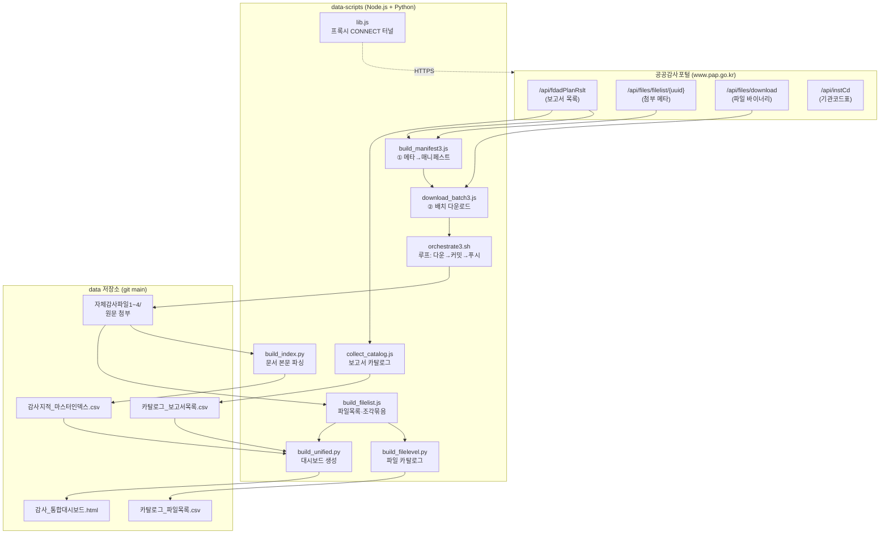
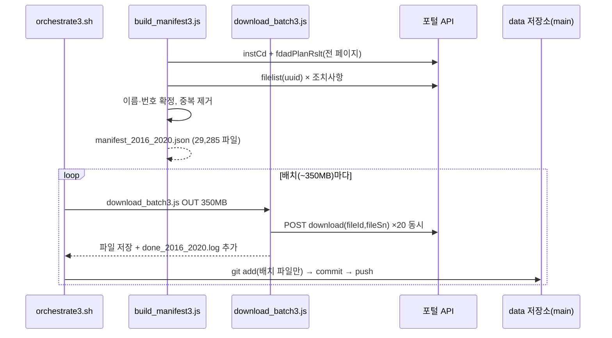

# 공공감사 데이터 수집·대시보드 시스템 — 설명서 & 기술 아키텍처

공공감사포털(pap.go.kr)의 **자체감사결과** 공개 데이터를 자동 수집하고, 검색·분석용 **통합 대시보드**와 **색인 CSV**를 생성하는 시스템의 기술 문서입니다.

- 대상 독자: 이 데이터를 재수집·확장·재생성하려는 개발자
- 최종 갱신 기준: 자체감사파일1~4(2016-01-01 ~ 2026-07), 첨부파일 약 86,481개(≈26GB)

---

## 목차
1. [개요](#1-개요)
2. [전체 아키텍처](#2-전체-아키텍처)
3. [저장소 구조](#3-저장소-구조)
4. [데이터 수집 파이프라인 (자동화)](#4-데이터-수집-파이프라인-자동화)
5. [대시보드 생성](#5-대시보드-생성)
6. [CSV 산출물](#6-csv-산출물)
7. [운영·재현 가이드](#7-운영재현-가이드)
8. [기술적 의사결정 & 트러블슈팅 이력](#8-기술적-의사결정--트러블슈팅-이력)
9. [스크립트 레퍼런스](#9-스크립트-레퍼런스)
10. [알려진 한계](#10-알려진-한계)

---

## 1. 개요

### 1.1 목적
공공감사포털이 공개하는 각 공공기관의 자체감사결과 문서(원문 pdf/hwp/hwpx)와 메타데이터를, **포털 REST API를 직접 호출**해 원본 그대로 수집·보관하고, 이를 브라우저에서 탐색할 수 있는 자기완결형 대시보드로 제공합니다. 임의 생성·요약·추측 데이터는 없습니다.

### 1.2 두 개의 저장소 (관심사 분리)

| 저장소 | 내용 | 규모 |
|---|---|---|
| **`haechyaning-commits/data`** | 실제 데이터 — 원문 첨부파일, 대시보드 HTML, 색인 CSV | ≈26GB |
| **`haechyaning-commits/data-scripts`** | 수집·가공 **코드만** (이 문서 포함) | ≈200KB |

데이터와 코드를 분리한 이유: 데이터 저장소가 대용량(20GB+)이라, 코드를 매번 그와 함께 클론하지 않도록 스크립트를 별도 저장소로 분리했습니다.

### 1.3 데이터셋 (기간 오름차순)

| 폴더 | 기간 | 첨부파일 | 지적 본문파싱 | 보고서 카탈로그 |
|---|---|---|---|---|
| `자체감사파일1/` | 2016-01-01 ~ 2020-12-31 | 29,285 | ✅ | ✅ |
| `자체감사파일2/` | 2021-01-01 ~ 2025-07-06 | 45,856 | ✖(재다운로드 필요) | ✅ |
| `자체감사파일3/` | 2025-07-07 ~ 2026-07-07 | 10,830 | ✅ | ✅ |
| `자체감사파일4/` | 2026-07-08 ~ (증분) | 515 | ✖ | 일부 |
| **합계** | **2016 ~ 2026** | **86,481** | 39,058건 지적 | 30,210 보고서 |

---

## 2. 전체 아키텍처

### 2.1 구성 요소와 데이터 흐름



### 2.2 핵심 설계 원칙
- **실제 데이터만**: 모든 파일은 API `download`로 받은 실물. 첨부 없는 보고서는 빈 파일을 만들지 않음.
- **번호를 미리 확정**: 이름이 겹치는 파일의 `(1)(2)…` 번호를 다운로드 전에 매니페스트 단계에서 계산 → 배치로 나눠 받아도 번호가 흔들리지 않음.
- **중단 후 재개**: 진행기록(done 로그/checkpoint)으로 세션이 끊겨도 이어서 진행.
- **자기완결형 산출물**: 대시보드 HTML은 외부 의존성 0 — 파일 하나로 오프라인 동작.

---

## 3. 저장소 구조

### 3.1 `data` 저장소 (main 브랜치)
```
자체감사파일1/   2016~2020 원문 (29,285)
자체감사파일2/   2021~2025 원문 (45,856)
자체감사파일3/   2025~2026 원문 (10,830)
자체감사파일4/   2026.7~ 증분 (515)
감사_통합대시보드.html      ← 통합 대시보드(자기완결형, ~20MB)
카탈로그_보고서목록.csv      ← 보고서 단위 색인 (30,210행)
카탈로그_파일목록.csv        ← 파일 단위 색인 (86,481행)
감사지적_마스터인덱스.csv    ← 문서 본문 지적 색인 (40,115행)
README.md / 자체감사수집정리.md / 품질점검.md / 데이터이용안내.md
```

### 3.2 파일명 규칙 (네 폴더 공통)
```
{감사실시기관}_{연도}년 {감사분야}.{확장자}
{감사실시기관}_{연도}년 {감사분야}(N).{확장자}   ← 같은 그룹에 서로 다른 문서가 여럿일 때
{...}_조각(k).{확장자}.part                      ← 90MB 초과 시 분할
```
- **감사분야**: API `adFldNm`(종합감사/특정감사/복무감사/성과감사/재무감사 등)
- **번호 (N)**: 같은 `기관_연도 분야` 그룹에서 첨부 **내용이 다를 때만** 등록일 최신순으로 `(1)(2)…` 부여. 내용(파일명+크기 또는 해시)이 같으면 1개만 저장.
- 번호 판정은 **폴더 내부에서만** 이뤄짐(폴더 간 연도가 달라 충돌 없음).

---

## 4. 데이터 수집 파이프라인 (자동화)

### 4.1 포털 REST API

| 엔드포인트 | 용도 | 핵심 파라미터 |
|---|---|---|
| `GET /api/fdadPlanRslt` | 보고서 목록(페이지) | `searchYmdBgng`, `searchYmdEnd`(수집기간), `palawInstClsfCd=30`(공공기관), `page`, `size` |
| `GET /api/files/filelist/{uuid}` | 조치사항 첨부 메타 | `fileId`, `fileSn`, `fileName`, `fileSize` 반환 |
| `POST /api/files/download` | 파일 바이너리 | body `{fileId, fileSn}` |
| `GET /api/instCd?palaw1InstClsfCd=30` | 기관코드→기관명 표 | 기관명이 `null`인 보고서 보정용 |

### 4.2 프록시 CONNECT 터널 (`lib.js`)
컨테이너 환경에서 외부 HTTPS는 프록시를 거칩니다. `lib.js`는 `HTTPS_PROXY` 환경변수를 읽어 `CONNECT`로 `www.pap.go.kr:443` 터널을 뚫고 HTTPS 요청을 보냅니다.
- **하드코딩 아님**: 매 요청마다 `process.env.HTTPS_PROXY`를 참조 → 컨테이너 재시작으로 **프록시 포트가 바뀌어도** 새 프로세스는 자동으로 새 포트 사용(§8.2 참고).

### 4.3 2단계 수집 (파일1 = 2016~2020 예시)



**① 메타데이터(매니페스트) 단계** — `build_manifest3.js`
- 전 페이지를 훑어 각 조치사항 첨부의 `fileId/fileSn/fileName/fileSize`를 확정.
- 페이지 내 100건을 한꺼번에 병렬 조회(동시성 40)해 네트워크 왕복 대기를 겹침 → 페이지당 약 5분 → 38초(약 8배).
- 이름 그룹별로 번호 계산 → `manifest_2016_2020.json` 출력, `manifest_2016_2020_checkpoint.json`에 진행 저장(재개용).

**② 다운로드 단계** — `download_batch3.js` + `orchestrate3.sh`
- 매니페스트에서 아직 안 받은 항목을 골라 **~350MB씩** 배치로 다운로드(동시성 20).
- HTTP 204(파일 미제공)는 재시도해도 안 되므로 건너뛰고 `unavailable` 로그 기록.
- 90MB 초과 파일은 `_조각(k).ext.part`로 분할 저장.
- 진행기록은 `done_2016_2020.log`(한 줄=한 파일). 배치가 저장한 정확한 경로는 `batch_files.txt`.

### 4.4 배치 커밋·푸시 (`orchestrate3.sh`)
- **왜 배치인가**: 한 번에 큰 pack을 push하면 프록시/GitHub의 요청 크기 상한(HTTP 413)에 걸림 → 배치 크기를 ~350MB로 제한.
- **sparse-checkout 안전**: `data`는 필요한 폴더만 체크아웃(sparse). 매 배치에서 **그 배치가 저장한 파일만** `git add`(폴더 전체 add 금지 — §8.1의 버그 원인)하고, 삭제가 스테이징되면 즉시 중단하는 안전장치 포함.
- **재개**: 컨테이너가 죽어도 done 로그와 원격 커밋을 대조해 미커밋분만 복구 후 재기동.

### 4.5 성능·안정성 파라미터
- 메타데이터 조회 동시성 **40**, 다운로드 동시성 **20** (과하면 포털이 502 반환).
- 일시 오류(502 등)는 **지수 백오프 1·2·3초**로 자동 재시도.
- push 실패는 0·2·4·8·16·30초 백오프로 재시도.

---

## 5. 대시보드 생성

### 5.1 `build_unified.py` — 입력/출력
```
입력  감사지적_마스터인덱스_{폴더}.csv   (문서 본문 지적, 폴더별)
      카탈로그_보고서목록_new.csv         (포털 공식 보고서 메타, 4폴더)
      filelist.json                       (전체 파일, 분할 조각 묶음)
출력  감사_통합대시보드.html              (자기완결형 HTML)
```

### 5.2 데이터 3층 (탭이 비슷해 보이지만 층이 다름)

| 층 | 출처 | 한 행 | 탭 |
|---|---|---|---|
| **지적** | 문서 **본문 파싱** 결과 | 문서 안의 개별 지적제목 | 지적 탐색, 벤치마크 |
| **보고서** | 포털 **API 공식 메타** | 감사 보고서 1건 | 보고서 탐색, 기관 프로파일, 모범사례 |
| **파일** | 실제 **첨부파일 목록** | 첨부파일 1개 | 파일 탐색 |

### 5.3 7개 탭
1. **현황** — 출처(기간)·감사분야·처분종류 분포
2. **지적 탐색** — 문서 본문에서 뽑은 지적제목 검색(파일1·파일3, 39,058건). 출처 컬럼·필터
3. **보고서 탐색** — 공식 메타(감사사항명·처분·모범사례) 통합 검색(30,210건). 출처 컬럼
4. **파일 탐색** — 전체 첨부파일 86,481개. 분할 파일은 원본으로 묶고 조각 링크
5. **기관 프로파일** — 기관 선택 → 연도추이·분야·처분·보고서 목록
6. **모범사례** — 포털 공식 모범사례 보고서 전체(7,651건)
7. **벤치마크** — 환경·에너지 동종기관 코호트의 반복 지적 + 사전점검 체크리스트

### 5.4 문서 본문 파싱 (`build_index.py`)
지적제목은 **문서 파일 내부를 열어** 추출합니다.

| 형식 | 파서 | 방법 |
|---|---|---|
| pdf | PyMuPDF(fitz) | 앞 2페이지 텍스트 |
| hwpx | zipfile + 정규식 | section XML의 `<hp:t>` |
| hwp | olefile + zlib | BodyText 섹션 압축해제 → `PARA_TEXT`(tag 67) 레코드 디코딩 |

- 정규식으로 "제목:" 라벨 또는 지적 어미(미흡/부적정/누락/위반…)를 포착해 지적제목화.
- 파일당 **30초 타임아웃**(한 파일이 멎어도 전체 배치가 멈추지 않게).
- 폴더를 인자로 받아 `감사지적_마스터인덱스_{폴더}.csv` 생성 → 대시보드가 여러 폴더를 합쳐 사용.

### 5.5 파일목록 & 분할 처리 (`build_filelist.js`)
- `git ls-tree`(★ `core.quotePath=false`로 한글 원문 이름 유지)로 4폴더 전체 파일 열거.
- `X_조각(k).ext.part` 조각들을 **원본 `X.ext` 하나로 묶고** 조각 링크 배열을 함께 보관 → 대시보드/CSV에서 원본 이름으로 표시.

### 5.6 자기완결성 & 배포
- 데이터(findings/reports/files)는 JSON으로 HTML에 **인라인 임베드**, CSS/JS도 인라인 → 외부 요청 0.
- GitHub 원문 HTML을 브라우저에서 바로 보려면 `raw.githack.com` CDN 링크 사용(README "바로 보기").

---

## 6. CSV 산출물

| 파일 | 행 | 스키마(주요) | 생성기 |
|---|---|---|---|
| `카탈로그_보고서목록.csv` | 30,210 | 폴더·파일명패턴·기관·연도·감사분야·감사사항명·처분종류·모범사례포함·조치사항수 | `collect_catalog.js` |
| `카탈로그_파일목록.csv` | 86,481 | 폴더·파일명·기관·연도·감사분야·감사사항명·처분종류·모범사례포함·GitHub링크·감사중복수·분할파일 | `build_filelist.js`→`build_filelevel.py` |
| `감사지적_마스터인덱스.csv` | 40,115 | 폴더·기관명·연도·감사분야·순번·지적제목·처분키워드·파일형식·파일크기·분할파일·파일명 | `build_index.py` |

- 모두 UTF-8 **BOM** 포함(엑셀 한글 호환).
- **정확도 주의**: 처분종류·모범사례는 포털 API **공식값**(정확), 지적제목은 문서 본문 규칙 추출(대부분 정확, 일부 근사).

---

## 7. 운영·재현 가이드

> 전제: `data` 저장소가 `/home/user/data`에 있고 `origin`이 `haechyaning-commits/data`(main)를 가리켜야 함. 스크립트는 `/home/user/data-scripts`에 있음. `HTTPS_PROXY` 설정 필요.

### 7.1 새 기간 데이터 수집
```bash
# 1) build_manifest3.js 상단 YMD_BGNG/END를 원하는 기간으로 수정, 출력파일명도 조정
node build_manifest3.js                       # 메타데이터 → manifest_*.json
# 2) orchestrate3.sh의 OUT/파일명 확인 후 실행 (배치 다운→커밋→push 루프)
bash orchestrate3.sh
```

### 7.2 보고서 카탈로그 재수집
```bash
# collect_catalog.js의 RANGES(폴더·기간)를 조정
node collect_catalog.js                        # → catalog.csv (BOM)
```

### 7.3 지적탐색 확장(문서 본문 파싱)
```bash
pip install PyMuPDF olefile
python3 build_index.py 자체감사파일1            # → 감사지적_마스터인덱스_자체감사파일1.csv
# 파일2를 하려면 먼저 그 폴더를 /home/user/data에 sparse-checkout으로 받아야 함(≈17GB)
```

### 7.4 대시보드 재생성
```bash
node build_filelist.js                          # filelist.json (조각 묶음)
python3 build_unified.py                         # 감사_통합대시보드.html
# data 저장소에 복사 후 커밋·push
```

---

## 8. 기술적 의사결정 & 트러블슈팅 이력

이 시스템을 구축하며 실제로 부딪힌 문제와 해결책입니다. 재작업 시 같은 함정을 피하세요.

### 8.1 sparse-checkout + `git add 폴더전체` = 배치 유실 버그
- **증상**: 배치를 push할 때마다 직전 배치 파일이 트리에서 사라져 원격에 한 배치분만 남음.
- **원인**: 디스크 절약을 위해 push 후 파일을 `skip-worktree`+`rm` 했는데, 다음 배치에서 `git add 자체감사파일3`(폴더 전체)를 하면 sparse 환경에서 없어진 파일들이 **삭제로 스테이징**됨.
- **해결**: (1) 전 배치 커밋 트리의 **합집합**을 재구성해 무손실 복구, (2) 오케스트레이터를 **배치가 저장한 파일만 targeted `git add`**하도록 변경(폴더 전체 add 금지) + 삭제 스테이징 감지 시 중단.

### 8.2 컨테이너 재시작 → 프록시 포트 변경으로 다운로더 hang
- **증상**: 재시작 후 진행이 멈춤(프로세스는 살아있음).
- **원인**: 실행 중이던 Node가 **옛 프록시 포트**를 물고 있어 모든 요청이 무응답.
- **해결**: 오케스트레이터가 매 배치 **새 Node 프로세스**를 띄우도록(=현재 `HTTPS_PROXY` 재참조), 재시작 감지 시 연결 테스트→done/원격 재대조→재기동.

### 8.3 대용량 pack push → HTTP 413
- **증상**: 큰 커밋 push가 413(요청 과대)로 거부.
- **해결**: 배치·복구 push를 모두 **~350MB 청크**로 분할. blob이 이미 원격에 있으면 thin-pack으로 전송량 최소화.

### 8.4 폴더 rename을 26GB 재업로드 없이
- 폴더명을 기간순 `자체감사파일1~4`로 통일할 때, 파일 내용이 동일하면 하위 트리 객체 SHA가 같음 → **루트 트리+커밋 2개 객체만** push되는 thin rename으로 처리.

### 8.5 한글 파일명 인코딩
- `git ls-tree --name-only`는 기본적으로 비ASCII를 **8진 이스케이프**(`\354\236…`)로 출력 → 파일목록/링크가 깨짐. `-c core.quotePath=false` 또는 `-z`로 원문 UTF-8 유지.

### 8.6 다운로더 hang-on-exit
- 프록시 keep-alive 소켓이 이벤트 루프를 붙잡아 다운로드 완료 후에도 프로세스가 안 끝나 오케스트레이터가 대기 → `main().then(()=>process.exit(0))`로 강제 종료.

---

## 9. 스크립트 레퍼런스

### 수집 (Node.js)
| 파일 | 역할 |
|---|---|
| `lib.js` | 프록시 CONNECT 터널 HTTPS 헬퍼(모든 Node 스크립트 공유) |
| `build_manifest3.js` | 2016~2020 메타데이터 수집·파일명 확정 → `manifest_2016_2020.json` |
| `download_batch3.js` | 매니페스트에서 ~350MB 배치 다운로드(동시성 20, 90MB 분할) |
| `orchestrate3.sh` | 다운→커밋→push 루프(배치 파일만 add, 삭제 감지 중단) |
| `collect_catalog.js` | 보고서 카탈로그(4폴더) 메타 수집 → CSV |
| `full_scrape.js` / `incremental_scrape.js` | (구) 전량/증분 수집기 |
| `build_manifest.js` / `build_manifest_gap.js` / `download_batch.js` / `orchestrate2.sh` / `flush_chunks.sh` / `apply_gap.js` | (구) 2021~2025(자체감사파일2) 수집 파이프라인 |

### 가공·대시보드 (Python/Node)
| 파일 | 역할 |
|---|---|
| `build_index.py` | 문서 본문 파싱(pdf/hwp/hwpx) → 지적제목 색인(폴더 인자) |
| `build_filelist.js` | `git ls-tree`로 전체 파일목록·조각 묶음 → `filelist.json` |
| `build_filelevel.py` | 파일 단위 카탈로그 CSV(GitHub 링크 포함) |
| `build_unified.py` | 통합 대시보드 HTML 생성 |
| `clean_titles.py` | 지적제목 후처리 정리 |
| `build_dashboard.py` / `build_report.py` / `page_report.py` | (구) 개별 대시보드·리포트·진행 보고 |

---

## 10. 알려진 한계
- **지적 탐색은 파일1·파일3만**: 문서 본문 파싱은 파일이 로컬에 있어야 하는 무거운 작업. 파일2(45,853개·17GB)는 재다운로드 후 파싱 필요, 파일4는 미처리.
- **자체감사파일4 보고서 메타 일부만**: 2026-07-08 이후 증분분은 포털 API의 날짜 필터 특성상 보고서 카탈로그가 일부만 잡힘(파일 탐색·파일목록에는 전량 표시).
- **지적제목 근사치 존재**: 스캔 PDF(텍스트 레이어 없음)·비정형 서식은 추출이 비거나 근사할 수 있음.
- **대시보드 용량**: 자기완결형 특성상 전체 데이터를 인라인 임베드 → 약 20MB(브라우저 로딩에 수 초).
- **카탈로그 그룹 단위**: 처분·모범사례는 `기관+연도+분야` 그룹 단위라, 한 그룹에 감사가 여러 건이면 파일을 개별 감사로 1:1 구분 불가(개별은 파일 탐색 탭 이용).

---

*이 문서는 시스템 재현·확장을 위한 기술 참조입니다. 이용·출처 표기는 data 저장소의 `데이터이용안내.md`를, 데이터 개요는 `README.md`를 참고하세요.*
